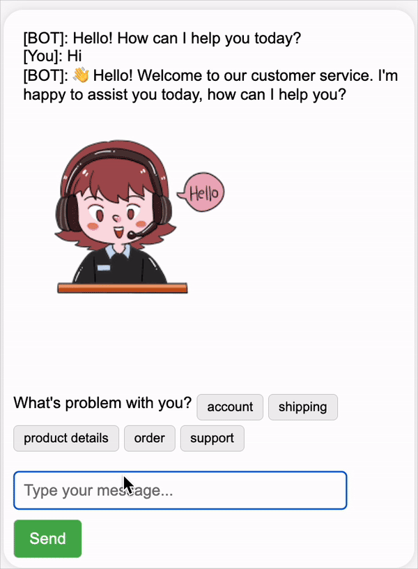

 <h1 align="center">CustomerBot</h1>

## Team members
* Lê Bá Đắc
* Nguyễn Thanh Quỳnh Tiên
* Dương Lý Tuyết Mai
* Nguyễn Thiện Bảo Châu

## Introduction

Here is my python source code for CustomerBot - a chatbot combines rule-based responses, machine learning, and recommendation system technologies for suporting customer on buying a product. With my code, you could: 
* **Interact with the chatbot in a traditional Q&A style, receiving relevant responses to your questions.**
* **Receive tailored product recommendations based on your specific needs and preferences**

## CustomerBot

## Dataset
The datasets used for training CustomerBot are available here:
* **Rule-Based and Machine Learning Training Data**: Our custom dataset, built for training rule-based and machine learning models, is available at [Own Dataset](https://github.com/lebadac/CustomerBot/blob/main/training_sample.json)

* **Recommendation System Dataset**: The dataset used for the recommendation system technology is from Kaggle and can be accessed at [Kaggle Dataset](https://www.kaggle.com/datasets/scodepy/customer-support-intent-dataset).

## Technology Stack
* **Rule-Based System**: Handles straightforward and frequently asked questions for quick, accurate responses.
* **Machine Learning Models**: Understands and interprets complex queries and user intent, enhancing interaction quality.
** **Recommendation Engine**: Provides personalized product suggestions based on user preferences and behaviors.
